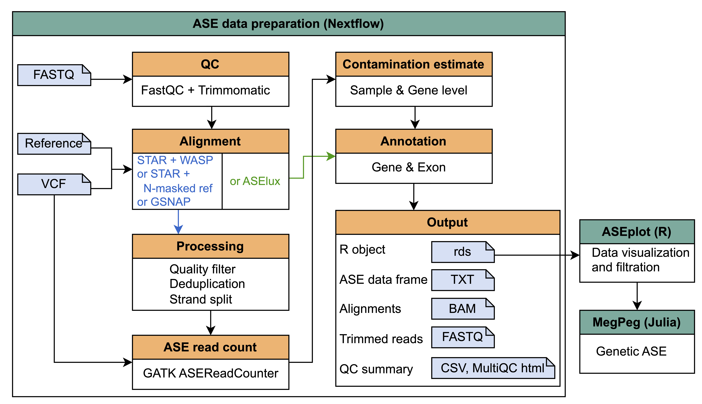

# ASET: <ins>A</ins>llele <ins>S</ins>pecific <ins>E</ins>xpression <ins>T</ins>oolkit

This nextflow pipeline processes Illumina RNA-Seq reads and generates a data frame that includes allele specific read count data at each SNP site across the samples, annotation for genes and exons. The output data can be taken by the [ASEplot](https://github.com/weishwu/ASEplot) R package for figure generation and genetic ASE test.

## Main steps in ASEprep:

- RNA-Seq reads are trimmed using `Trimmomatic`.
- One of four alignment approaches can be chosen:
  - `STAR_WASP`: reads are aligned using `STAR` with `--waspOutputMode SAMtag` and a coupled VCF containing SNPs to activate WASP filtering. The alignments that have the `vW` value > 1 are removed.
  - `STAR_NMASK`: reads are aligned using `STAR` against a genome with SNP positions masked as N.
  - `GSNAP`: reads are aligned using `GSNAP` in the SNP-tolerant mode.
  - `ASElux`: reads are aligned and counted using `ASElux`.
- Alignments are filtered, deduplicated, and strand split, unless using `ASElux` which integrates alignment and counting.
- Unless `ASElux` is chosen as the mapper, `ASEReadCounter` from `GATK` is used to calculate allele specific read counts from each strand separately, using the coupled VCF.
- Exons and genes are extracted from the provided GENCODE GTF. Union exons are generated by merging overlapped exons for each gene. ASE sites are then labelled with the gene IDs and union exon coordinates.
- Sample-level contamination can be estimated by calculating non-alt allele frequency at 1/1 sites, and non-ref allele frequency at 0/0 sites (when reference calls are provided in a separate VCF).
- Gene-level maternal contamination for placental samples can be estimated by calculating the mean non-ref allele frequency at 0/0 sites when the maternal genotypes are not 0/0.
- Outputs include trimmed reads, alignments, QC summary (in CSV and MultiQC html), an ASE data frame in TXT, and an Rds file containing the ASE data  and the merged exon coordinates. This file can be taken by the ASEplot R package for figure generation and genetic ASE test.

## Flow charts
- Overview

- [DAG if using `STAR_WASP`](./test_data/reports_starWasp/run_report/dag.png)
- [DAG if using `STAR_NMASK`](./test_data/reports_starNmask/run_report/dag.png)
- [DAG if using `GSNAP`](./test_data/reports_gsnap/run_report/dag.png)
- [DAG if using `ASElux`](./test_data/reports_aselux/run_report/dag.png)

## Inputs and parameters:
- A sample sheet:
  - For the `from_fastq` mode: ([example](./test_data/sample_sheet.from_fastq.csv))
    - `sample`: sample name
    - `read1`: path to read 1
    - `read2`: path to read 2
    - `snps`: required VCF that contains the heterozygous and homozygous SNPs used for read mapping and ASE read counting
    - `snps_with_ref` (optional): VCF that contains called referece sites, in addition to the variants. If this VCF is provided, it will be used for ASE read counting so that the referece sites will be also examined to check potential contamination ([example](./test_data/sample_sheet.from_fastq.more_snps.csv))
  - For the `from_bam` mode: ([example](./test_data/sample_sheet.from_bam.csv))
    - `sample`: sample name
    - `bam`: path to the alignment file
    - `snps` and `snps_with_ref`: same as above
- params.yaml: ([example](./test_data/params.yaml)) 
  - `routine`: can be either `from_fastq` or `from_bam`
  - `mapper`: can be either `STAR_WASP`, `STAR_NMASK`, or `GSNAP`
  - `sample_sheet`: path to the sample sheet
  - `results_dir`: path to the folder where some of the key result files will be copied to
  - `genome_fa`: genome fasta
  - `gtf`: GTF used for gene annotation
  - `rRNA_tRNA_bed`: bed file containing rRNA and tRNA regions, used for Picard CollectRnaSeqMetrics
  - `adapters`: adapter sequences used by Trimmomatic for adapter trimming
  - `rna_strandedness`: either `SECOND_READ_TRANSCRIPTION_STRAND` or `FIRST_READ_TRANSCRIPTION_STRAND`
  - `rna_readlen`: read length, used for STAR genome generation
  - `ase_depth_min`: minimum total read depth required for allele frequency calculation to measure contamination
  - `phase_info` (optional): 
    - `sample`: sample name
    - `phase_info`: phased genotypes to append to the ASE data frame, if available
  - `maternal_vcf` (optional):
    - `sample`: sample name
    - `mat_snps`: maternal genotyping VCF, used for maternal contamination filtration
  - `tool_parameters`: parameters for trimming, alignment, filtering, and ASE read counting

## Output files

- run_report: contains `report.html`, `timeline.html`, `trace.txt`, and `dag.png`.
- results
  - ase_data
    - ASE_hetSNP.txt: ASE read counts on 0/1 SNPs
    - ASE_homSNP.txt: ASE read counts on 1/1 SNPs
    - ASE_homRef.txt: ASE read counts on 0/0 sites
    - ASE_on_hetSNPs.txt.gz: final ASE data frame. Column description is shown in [column_description.txt](./test_data/column_description.txt)
    - ase_data.Rds: final ASE data frame and merged exon coordinates in Rds, which can be taken by the [ASEplot](https://github.com/weishwu/ASEplot) R package for figure generation and genetic ASE test
  - aln
    - 01.raw_aln: alignments from aligner 
    - 02.aln_hc: alignments after filtering
    - 03.aln_hc_dedup: alignments after deduplication
    - 04.aln_hc_dedup_strandsplit: alignments split into two strands
  - qc
    - trimmed_reads: reads trimmed by Trimmomatic
    - fastqc.raw_reads: fastqc report for raw reads
    - fastqc.trimmed_reads: fastqc report for trimmed reads
    - aln_hc_metrics: output from Picard CollectRnaSeqMetrics
    - pre_trim.multiqc.html: MultiQC report summarizing FastQC reports for raw reads
    - post_trim.multiqc.html: MultiQC report summarizing FastQC reports for trimmed reads, Trimmomatic trimming stats, STAR alignment stats, MarkDuplicates deduplication stats, and CollectRnaSeqMetrics output
    - QC_summary.txt: summary of QC metrics in a data frame
  - ref_data
    - gtf_flat.txt: provided GTF converted to a data frame with selected fields
    - ref_gtf_genes.bed: gene coordinates extracted from GTF
    - ref_gtf_exons.bed: exon coordinates extracted from GTF
    - gtf.exonMergedByGenes.bed: union exons merged for each gene
  - tool_versions.txt: versions of the tools used in the pipeline
